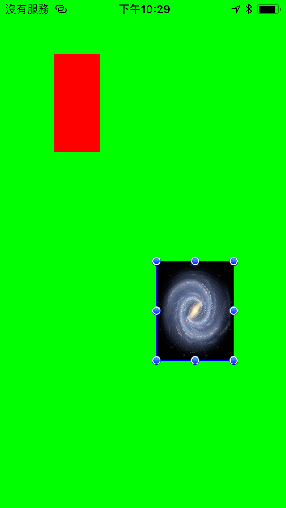

# IRUserResizableView 

- IRUserResizableView is a powerful resizable view for iOS.
- IRUserResizableView is modeled after the resizable image view from the Pages iOS app. Any UIView can be provided as the content view for the IRUserResizableView. As the view is respositioned and resized, setFrame: will be called on the content view accordingly.

## Features
- Resizable.

## Install
### Git
- Git clone this project.
- Copy this project into your own project.
- Add the .xcodeproj into you  project and link it as embed framework.
#### Options
- You can remove the `demo` and `ScreenShots` folder.

### Cocoapods
- Add `pod 'IRUserResizableView'`  in the `Podfile`
- `pod install`

## Usage

### Basic
``` objective-c
#import "IRUserResizableView.h"

...

- (void)viewDidLoad {
CGRect frame = CGRectMake(50, 50, 200, 150);
IRUserResizableView *userResizableView = [[IRUserResizableView alloc] initWithFrame:frame];
UIView *contentView = [[UIView alloc] initWithFrame:frame];
[contentView setBackgroundColor:[UIColor redColor]];
userResizableView.contentView = contentView;
[self.view addSubview:userResizableView];
[contentView release]; 
[userResizableView release];
}
```

If you'd like to receive callbacks when the IRUserResizableView receives touchBegan:, touchesEnded: and touchesCancelled: messages, set the delegate on the IRUserResizableView accordingly. 

``` objective-c
userResizableView.delegate = self;
```

Then implement the following delegate methods.

``` objective-c
- (void)userResizableViewDidBeginEditing:(IRUserResizableView *)userResizableView;
- (void)userResizableViewDidEndEditing:(IRUserResizableView *)userResizableView;
```

By default, IRUserResizableView will show the editing handles (as seen in the screenshot above) whenever it receives a touch event. The editing handles will remain visible even after the userResizableViewDidEndEditing: message is sent. This is to provide visual feedback to the user that the view is indeed moveable and resizable. If you'd like to dismiss the editing handles, you must explicitly call -hideEditingHandles.

The IRUserResizableView is customizable using the following properties:

``` objective-c
@property (nonatomic) CGFloat minWidth;
@property (nonatomic) CGFloat minHeight;
@property (nonatomic) BOOL preventsPositionOutsideSuperview;
```

For an example of how to use IRUserResizableView, please see the included example project.


## Screenshots


## Copyright
##### This project is inspired from [SPUserResizableView](https://github.com/spoletto/SPUserResizableView).
